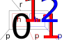

# 2-3 Strom - Dokumentácia
_Zápočtový program, 1. semester **Jakub Čatloš**_

## Úvod
Cieľom môjho zápočtového programu bolo implementovať 2-3 Strom s funkciami Insert, Delete 
a funkciou umožňujúcou zobrazenie jeho obsahu v programovacom jazyku Pascal. Výsledkom je 
jednotka s názvom Strom23. Celá jednotka sa skladá z menších podjednotiek: 
* **Strom23_Init:** Obsahuje funkciu *InitTree*, ktorá inicializuje prázdny strom.
* **Strom23_Typy:** Obsahuje definície typov použitých na reprezentáciu celého stromu.
* **Strom23_Insert:** Obsahuje funkciu *Insert*, ktorá vloží hodnotu do stromu.
* **Strom23_Delete:** Obsahuje funkciu *Delete*, ktorá zmaže hodnotu zo stromu.
* **Strom23_Vypis:** Obsahuje funkciu *VypisStrom*, ktorá na výstup vypíše obsah uloženého stromu.

Podrobný popis týchto funkcií sa nachádza v časti [Použité funkcie a dátové štruktúry](#Použité-funkcie-a-dátové-štruktúry)

### Návod na použitie
Všetky podjednodnotky môžete naraz pridať do programu pridaním jednotky `Strom23`. Samozrejme, ľubovoľnú podjednotku môžete pridať samostatne.

Na vytvorenie nového stromu potrebujete definovať premennú typu `pVrchol` ako smerník na koreň tohoto stromu a uložiť do nej výctup funkcie `InitTree`.

Na vloženie hodnoty do tohoto stromu slúži funkcia `Insert`. Tá požaduje 2 parametre: koreň vytvoreného stromu (typu `pVrchol`) a samotnú vkladanú hodnotu (nezápornú a typu `longint`).

Na vypísanie obsahu celého stromu slúži funkcia `VypisStrom`, ktorá berie ako jediný parameter koreň stromu (typu `pVrchol`), ktorý má vypísať.

Na zmazanie hodnoty zo stromu slúži funkcia `Delete`. Tá, rovnako ako funkcia `Insert`, požaduje 2 parametre: koreň vytvoreného stromu (typu `pVrchol`) a samotnú odstraňovanú hodnotu (nezápornú a typu `longint`). Ak sa hodnota v strome nenachádza, nič sa nestane.

**Poznámka:** Aj keď je to možné, funkcie `Insert` a `Delete` nie je odporúčané volať na podstromy, pretože sa pri nich môže zmeniť hĺbka podstromu, čo by spôsobilo nevyváženosť celého stromu. 

V zložke, v ktorej sa nachádza celá jednotka sa nachádza aj program `test.pas`, ktorý demonštruje, ako sa jednotka používa.

#### Príklad použitia:
```
uses Strom_23;
var koren: pVrchol;
begin
    koren := Strom23.InitTree;
    Strom23.Insert(koren, 42);
    Strom23.VypisStrom(koren);
    Strom23.Delete(koren, 42);
end.
```


## Popis algoritmu

2-3 stromy sú alternatívou v AVL-stromom ako druh vyváženého vyhľadávacieho stromu. Ideou 2-3 stromu je, že z každý vrchol môže obsahovať 1 alebo 2 hodnoty a teda môže mať 2 alebo 3 synov. Na to, aby bol strom 2-3 stromom musí spĺňať tieto podmienky:
1. Každý vrchol môže mať najviac 3 synov.
2. Vrchol obsahujúci n hodnôt musí mať n+1 synov (okrem listov).
3. Strom nemôže obsahovať prázdny vrchol.
4. Všetky listy sú na rovnakej úrovni.

Z týchto pravidiel vyplýva, že log3(n) <= hĺbka stromu <= log2(n) (Ak by každý vrchol obsahoval práve jednu hodnotu, jednalo by sa o binárny strom a ak by strom bol plný, tak na každej vrstve je 3^n vrcholov). Operácie [vkladania](#Insert) a [vyhadzovania](#Delete) hodnôt zo stromu sú popísané v časti _Použité funkcie a dátové štruktúry._ 

## Použité funkcie a dátové štruktúry
V tejto časti je popísané fungovanie všetkých funkcií implementovaných jednotkou Strom23
### Dátové štruktúry
Strom sa skladá z vrcholov:
```
Vrchol = record
    Rodic: pVrchol;
    Prvky: array [1..2] of pPrvok;
    Syn: pVrchol;
end;
```
Kde `Rodic` je smerník na "predchodcu" tohoto vrcholu, `Syn` je smerník na vrchol (a celkovo podstrom) obsahujúci hodnoty menšie/rovné hodnote prvého prvku a `Prvky` je dvojprvkové pole typu `Prvok`:
```
Prvok = record
    Hodnota: longint;
    Pocet: longint;
    Syn: pVrchol;
end;  
```
Kde `Hodnota` je číslo uložené vo vrchole, počet udáva, koľkokrát sa daná hodnota v strome nachádza a `Syn` je smerník na vrchol obsahujúci hodnoty väčšie ako hodnota tohoto prvku. 



Na obrázku je schematicky znázornený typ `Vrchol`. `Prvok[1]` a `Prvok[2]` Sú farebne vyznačené - `p0` ukazuje na vrchol so striktne menšími hodnotami ako `h1`, `p1` ukazuje na hodnoty väčšie ako `h1`, ale menšia ako `h2` a `p2` ukazuje na hodnoty väčšie ako `h2`. Pointer `r` ukazuje na rodiča vrcholu. Takáto reprezentácia mi umožnila jednoduchšiu implementáciu funkcie [Insert](#Insert), pretože miesto presúvania hodnoty a podstromu s väčšími hodnotami oddelene som ich mohol premiestňovať súčasne.

### InitTree
Funkcia `InitTree` vráti `nil`, keďže `nil` reprezentuje prázdny strom. Ostatné funkcie sú prispôsobené práci s prázdnym stromom.
### Insert
Vkladanie hodnoty do 2-3 stromu sa vždy začína v liste. To znamená, že vkladanej `hodnote` musíme nájsť list, do ktorého ju vložíme. Keďže sme vo vyhľadávacom strome, toto nie je vôbec ťažké - v každom vrchole sa pozrieme, či je `hodnota` väčšia ako všetky prvky vrcholu, menšia ako všetky hodnoty vrcholu alebo je medzi nimi. Na základe tohoto sa presunieme do adekvátneho vrcholu. Tu si musíme dávať pozor na 2 veci:
1. Keďže v strome nechceme mať duplicitné hodnoty, tak sa v každom vrchole musíme pozrieť na to, či sa v ňom `hodnota` už náhodou nenachádza. Ak áno, tak počet hodnôt zvýšime o 1 a vrátime sa z funkcie, pretože hodnota sa v strome už nachádza.
2. Prvý prvok vrcholu zaručene existuje (z 3. podmienky 2-3 stromu), ale ten druhý nemusí existovať. Preto si pri práci s 2. prvkom musíme vždy pozrieť, či prvok existuje.

Keď sme sa konečne dostali do listu, môžu nastať tieto 2 situácie:
1. V liste máme voľné miesto
2. List je plný

V prvom prípade stačí hodnotu vložiť na správne miesto a máme hotovo.
V druhom prípade musíme rozštiepiť list. To znamená, že musíme:
1. Nájsť prostredný prvok vo vrchole
2. Tento prvok vložíme do rodiča a jeho synom bude najväčší z prvkov
     * Presne kvôli tomuto kroku som zaviedol reprezentáciu `Prvku` tak, ako som ju zaviedol. Pretože nám stačí zobrať prostredný prvok, dať mu za syna väčší z prvkov (predtým musíme vytvoriť vrchol obsahujúci tento prvok), tento prvok zmazať z vrcholu a prostredný prvok poslať do rodiča. Keďže tento vrchol obsahuje prvky väčšie ako jeho prvok, z ktorého sme sa sem dotali, tak celý prvok stačí iba zaradiť do vrcholu za tento prvok a máme hotovo.

Ak je v rodičovi tohoto vrcholu voľné miesto, tak máme hotovo. Ak nie tak celý tento proces opakujeme. až kým sa nedostaneme v koreni. Ak musíme štiepiť koreň, tak vytvoríme nový vrchol, do ktorého vložíme prostredný prvok a `koren` prestavíme na tento vrchol. Tadá, strom nám práve narástol o 1 vrstvu!

#### Časová zložitosť
Nájdenie listu, do ktorého budeme hodnotu vkladať nám bude trvať \[Theta\](log n), keďže log3 n <= výška stromu <= log2 n. Pri prípadnom preplnení vrcholu a všetkých jeho rodičov budeme musieť ísť až do koreňa, čo nás bude stáť rovnako veľa operácií (až na konštantu), takže celé vkladanie vieme v najhoršom prípade odhadnúť na **\[Theta\](log n)**.

### Delete
Funkcia `Delete` nájde hodnotu v strome. Ak sa hodnota v strome nachádza viackrát, tak zmaže iba jeden jej výskyt. Ak hodnota nie je v liste, tak ju vymení s najmenšou hodnotou, ktorá je väčšia a nachádza sa v strome.
* Táto hodnota je najmenšia v podstrome s koreňom v synovi prvku obsahujúcom hľadaú hodnotu.
* Túto hodnotu tam dávame, pretože všetky ostatné hodnoty v tomto podstrome sú väčšie ako táto ale zároveň táto hodnota. Zároveň, keďže je väčšia ako hodnota, ktorú mažeme a menšia ako hodnota v nasledujúcom prvku (inak by nebola v tomto podstrome), prvky v tomto vrchole zostanú zoradené. Podobný výsledok by sme dostali aj s najväčšou hodnotou predchádzajúceho syna, ale to by spôsobovalo zbytočné ťažkosti v implementácii.

Teraz sa dostaneme do vrcholu, kde sa mazaná hodnota nachádza a vymažeme ju. Ak vo vrchole nie je sama, tak máme hotovo, inak musíme opravovať strom.

Táto funkcia je implementovaná rekurzívne, aby sme po každom návrate mohli skontrolovať syno, či nie sú prázdni. Takže vždy nastane jedna zo 4 situácií.
1. Všetci synovia sú v poriadku, takže môžeme skončiť
2. Vraciame sa z najmenšieho syna vrcholu, ktorý podtiekol a nasledujúci syn má 2 prvky
    * V tomto prípade vieme prvky "zarotovať". Prvý prvok z rodiča dáme do prázdneho syna, 1. prvok plného syna dáme na miesto rodiča a druhý prvok plného syna posunieme na začiatok vrcholu. Najmenšieho syna plného syna prepojíme na miesto najväčšieho syna v prázdnom vrchole.
3. Vraciame sa z iného syna vrcholu, ktorý podtiekol, ale menší syn má 2 prvky
    * V tomto prípade postupujeme rovnako ako v prípade 2, ale zrkadlovo.
4. Vraciame sa zo syna, ktorý podtiekol, ale ostatní synovia obsahujú iba 1 prvok
    * V tomto prípade musíme spojiť vrchol. To znamená, že do jednoho vrcholu dáme rodiča a súrodenca a ten druhý vrchol zmažeme.

Ak sme v koreni a výsledkom týchto operácií nám ostal už iba jediný syn s jedným prvkom, tak doňho vložíme prvok z koreňa ako druhý prvok a koreň zmažeme. Týmto nám klesla úroveň stromu.

#### Časová zložitosť
Nájdenie hodnoty, ktorú chceme mazať a jej prehodenie s vhodnou hodnotou v liste zaberie \[Theta\](log n) operácií (ak hodnota nie je v liste, musíme prejsť práve zvyšok cesty z koreňa do listu). Opravovať budeme tiež iba maximálne log n - krát, takže celková časová zložitosť mazania je **\[Theta\](log n)**.

### VypisStrom
Funkcia `VypisStrom` prehľadá celý strom, pričom každému vrcholu priradí jeho hĺbku v strome. Keď vrchol spracuje, vypíše ho na výstup. 
#### Prehľadávanie
Na prehľadávanie stromu je použitý algoritmus DFS, pretože ten prehľadáva vrcholy v poradí, ktoré viac vyhovuje vypisovacej funkcii popísanej [tu](#Výpis). Algoritmus som implementoval cez zásobník, a ku každému vrcholu si uložím jeho hĺbku (hĺbka koreňa = 0 a hĺbka každého vrcholu je hĺbka jeho rodiča + 1).
Dvojicu (Vrchol, Hĺbka) som reprezentoval typom `VrcholSHlbkou` a prvky zásobníku som reprezentoval typom `Fronta` (Prehľadné, však?):
```
type 
    pFronta = ^Fronta;
    pVrcholSHlbkou = ^VrcholSHlbkou;

    VrcholSHlbkou = record         
        Vrchol: pVrchol;
        Hlbka: longint;
    end;

    Fronta = record
        Vrchol: pVrcholSHlbkou;      
        Dalsi: pFronta;             
    end;
```
Na začiatku prehľadávania na zásobník vložím koreň.

Iterujem, kým zásobník nie je prázdny. V každom kroku vyberiem zo zásobníka vrchný vrchol.  Jeho synov vložím (s ich hĺbkou) na zásobník v zostupnom poradí (aby z neho vyšli vzostupne) a vrchol aj s jeho hĺbkou a príznakom predám funkcii `VypisVrchol`.

#### Výpis 
Pre vypisovanie hodnôt uložených v strome som sa rozhodol použiť *zvislý* formát, pretože:
* Keďže výška 2-3 Stromu je logaritmická, jeho šírka rastie exponenciálne, čo pri obmedzenej šírke monitora spôsobuje problémy s prehľadným vykresľovaním. 
* Pri každom vrchole by som musel počítať jeho šírku, aby som vedel strom vykresliť 
* Šírku stromu určuje šírka jeho najspodnejšej vrstvy. Takže aby som ho mohol vykresliť, musel by som ho prejsť minimálne raz aby som spočítal šírku každej vrstvy (ktoú by som musel držať v pamäti) a potom znova, aby som ho vykreslil.
* (Bolo by to zbytočne pracné a na prehľadnosti by to nepridalo)

*Zvislým* formátom myslím, že vypíšem vrchol, a pod neho vypíšem všetkých jeho synov vo vzostupnom poradí. Pre prehľadnosť, z každého vrcholu vedú šípky do jeho synov a za každú hodnotu vypíšem do hranatých zátvoriek, koľkokrát sa táto hodnota vo vrchole nachádza.
```
˯ |4[1]|
╠╦» |2[1]|
║╠═» |1[1]|
║╚═» |3[1]|
╠╦» |6[1] , 8[1]|
║╠═» |5[1]|
║╠═» |7[1]|
║╠═» |9[1]|
```
Takto viem každému vrcholu nájsť rodiča, jeho synov a aj určiť, v akej hĺbke sa nachádza (počet zvislých čiar vykreslených pred vrcholom). Na túto reprezentáciu som zvolil algoritmus DFS, keďže najprv potrebujem vykresliť celý podstrom vrcholu a až potom vykresliť jeho súrodenca. O samotné vykreslenie vrcholu sa stará funkcia `VypisVrchol`, ktorá na vstupe berie vrchol, jeho hĺbku a príznak určujúci, či je vrchol posledným synom svojho rodiča, ktorý budeme vykresľovať. 

Funkcia vypíše `hlbka-1` zvislých trubiek (`║`), ktoré nadväzujú na všetky doteraz nevykreslené podstromy. Potom vypíše zahnutú trubku (`╠` prípadne `╚`, ak je nastavený príznak `jePosledny`) - ak sme v koreni, nevypíše sa nič, keďže sme sa sem nedostali z rodiča. Napokon vypíše vodorovnú trubku (`═` ak je vrchol list, `╦` ak vrchol má synov) a šípku ukazujúcu na hodnoty vo vrchole. Tie sú ohraničené zvislítkami (`|`) a ak sú vo vrchole 2 hodnoty, tak sú oddelené čiarkou. Za každou hodnotou vo vrchole je v hranatých zátvorkách (`[]`) napísané, koľkokrát sa hodnota nachádza v strome. `-1` určujúce prázdne miesta vo vrchole nie sú vypísané.

#### Časová zložitosť
Funkcia `VypisVrchol` na začiatku vypisuje počet zvislých trubiek závislý od hĺbky vrcholu a teda celého stromu, jej časovú zložitosť vieme odhadnúť ako \[Theta\](log n), kde n = počtu hodnôt uložených do stromu. Samotné prehľadávanie sa pozrie na každý vrchol práve raz. Keďže v každom vrchole je 1 alebo 2 hotnoty, tak potom n/2 <= počet vrcholov <= n. Takže časová zložitosť celého algoritmu je **\[Theta\](n*log n)**.


